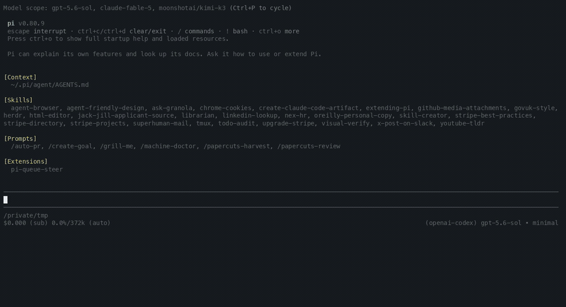

# pi-queue-steer

[](https://github.com/tmustier/pi-queue-steer/actions/workflows/ci.yml)
[](LICENSE)

A visible steering and follow-up timeline for [Pi](https://github.com/earendil-works/pi-mono).

Queue instructions while the agent works. Steering stays in a blue next-turn box. Follow-ups stay in a yellow after-this-run box beneath it. Both lanes remain independent first-in, first-out queues and keep Pi’s delivery timing.

Move into any row to edit it. The selected row becomes the live Pi editor, with its cursor, wrapping, paste handling, autocomplete and custom-editor behaviour intact.

## Demo



## Install

Install the latest version from GitHub:

```bash
pi install git:github.com/tmustier/pi-queue-steer
```

Pin the first release:

```bash
pi install git:github.com/tmustier/pi-queue-steer@v0.1.0
```

Then start a new Pi session or run `/reload`.

Try a local checkout for one session:

```bash
pi -e ./index.ts
```

## Controls

The extension follows your configured Pi action bindings. These are the default keys on macOS terminals:

| Context | Key | Action |
|---|---|---|
| Agent working | `Enter` | Add visible steering for Pi’s next safe turn boundary |
| Agent working | `Option+Enter` | Add a visible follow-up for after the run |
| Queue visible | `Option+Up` | Select the most recently queued row |
| Editing a row | `Option+Up` | Keep the current draft and move to the previous visual row |
| Editing a row | `Option+Down` | Keep the current draft and move to the next visual row |
| Editing a row | Type normally | Edit directly inside the selected row |
| Editing a row | `Option+X` | Mark the selected row for removal; save deletes it, a second press restores it |
| Editing a row | `Option+T` | Move the selected row to the other lane when saved |
| Editing a row | `Enter` or `Option+Enter` | Save all row edits without changing their lanes |
| Editing a row | `Escape` | Cancel the session and roll back all unsaved row edits |
| Empty composer, follow-up queued | `Enter` | Promote the oldest follow-up to steering now |
| Queue paused after an abort | `Enter` | Resume from the next steering row, or the next follow-up |
| Agent working, queue visible | `Escape` | Abort the run and pause both visible lanes |

`Option+Down`, `Option+X` and `Option+T` are the only new fixed shortcuts. The other controls use Pi’s configured action bindings. Terminals outside macOS may label `Option` as `Alt`.

## Delivery semantics

The extension keeps Pi’s 2 delivery classes:

- steering reaches the current run at Pi’s next safe turn boundary
- follow-ups wait until the run finishes
- the blue steering box remains above the yellow follow-up box
- each lane keeps its own first-in, first-out order
- Pi’s `one-at-a-time` and `all` settings apply independently at active-run delivery boundaries

The extension hands messages back to Pi’s native queues only when their delivery boundary arrives. They remain visible and editable before that point. Pi records delivered rows as normal user messages.

## Command rows

Rows whose text is exactly `/compact`, `/compact <instructions>` or `/reload` are command rows. They execute the Pi command instead of becoming an LLM message:

- `Option+Enter` while the agent works queues the command in follow-up order
- a command row executes only once the agent is idle; rows behind it wait — so `/compact` followed by `continue` compacts first and delivers `continue` after compaction completes
- `/reload` runs Pi’s built-in reload; rows queued behind it are restored after the runtime swap
- `Enter` on `/reload` while the agent works queues it too, replacing Pi’s built-in “wait until the agent finishes” warning; `Enter` on `/compact` keeps Pi’s built-in immediate behaviour
- `Option+Enter` on a command while the agent is idle executes it immediately instead of sending the text to the model
- command rows show a `⚙` marker and pause, resume and edit like any other row; editing a row into or out of command form just works

## Editing semantics

- `Option+Up` starts at the row you queued most recently
- `Option+Up` and `Option+Down` then move through the visible timeline
- saving never changes a row’s lane implicitly; `Option+T` re-lanes the selected row explicitly, and it joins the tail of its new lane on save
- a re-laned row previews inside its destination box before the save commits it
- `Option+X` marks the selected row for removal; save deletes it, and `Escape` or a second `Option+X` restores it
- a selected row becomes the real editor without a nested composer frame
- one editing session can hold drafts for several rows
- `Escape` restores every row from the session snapshot, including removal marks and lane toggles
- saving an empty text-only row removes it
- image-only rows survive text clearing; `Option+X` removes them
- an unrelated composer draft is stashed and restored when editing ends

A touched head row is pinned until you save or cancel. In `one-at-a-time` mode, later rows do not block the head. In `all` mode, editing any row holds that whole lane at active-run delivery boundaries.

## Abort and recovery

Aborting a run pauses both visible lanes. This prevents a follow-up from starting immediately after the abort.

Press `Enter` on the empty composer to resume. A failed handoff returns the affected batch to the front of its lane.

Queue state, pause state and edit drafts are session-local. They never enter the Pi transcript.

## Proof limitation

If an `all`-mode lane stays pinned until the agent settles, saving from idle restarts the run with that lane’s head. Pi receives the remaining rows at the next native boundary. Exact single-batch restart after this edge case remains open before release.

## Editor composition

pi-queue-steer wraps the active Pi editor. It does not replace Pi’s input model.

For display, it extracts the live editor’s text and cursor from the editor frame. It then places that content inside the selected queue row. Autocomplete remains below the edited text.

The extension composes with custom editors including raw-paste and pi-session-hud.

## Development

```bash
npm install
npm run ci
pi -e ./index.ts
```

The automated suite covers both lanes, queue modes, delivery boundaries, stable edits, rollback, removal marks, lane toggles, command-row parsing and batch cuts, abort recovery, image preservation, failed handoffs, editor-frame extraction and editor composition. Check TUI changes in a real interactive Pi session as well.

Tested with Pi 0.80.9.

## Security

Pi extensions run with the same system permissions as Pi. Review extension source before installing a third-party package.

## Licence

MIT. See [LICENSE](LICENSE).

This project draws on Cursor’s queue interaction. It is not affiliated with Cursor or Anysphere.
